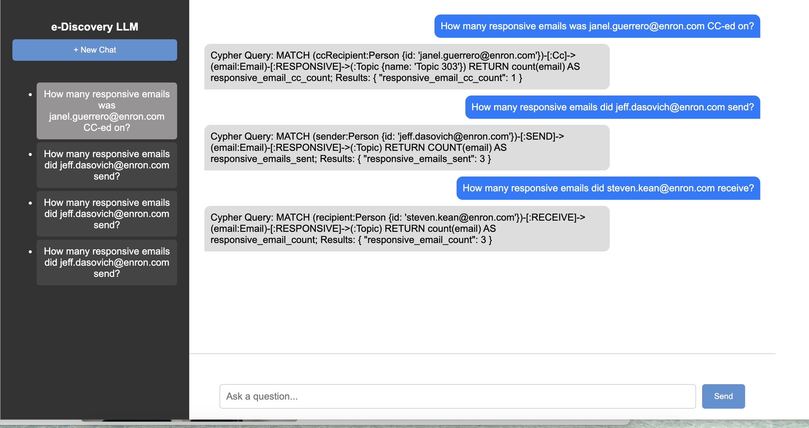

# **Chatbox Interface for Epiq LLM Project**

A dynamic, interactive chatbox interface designed to integrate with the **Epiq LLM** project. This application supports **multiple chat sessions**, **resizable sidebar**, and **real-time AI-powered conversations**.



---

## **Features**
✅ **Multi-Session Chat** – Each chat session has independent memory  
✅ **Resizable Sidebar** – Adjust the sidebar width dynamically  
✅ **Keyboard Shortcuts** – Press **Enter** to send messages  
✅ **Backend API Integration** – Connects to LLM via API requests  

---

## **Installation & Setup**

### **1️⃣ Clone the Repository**
```sh
git clone https://github.com/your-username/chatbox_LLM.git
cd chatbox_LLM
cd chat-box
```

### **2️⃣ Install Frontend Dependencies**
```sh
npm install
```

### **3️⃣ Start the Frontend Development Server**
```sh
npm run dev 
```

---

## **Neo4j Backend Setup**

### **4️⃣ Start a Local Neo4j Database**
Make sure you have [Neo4j Desktop](https://neo4j.com/download/) or a Neo4j local instance running at:

```
bolt://localhost:7687
```

Set the username and password accordingly 

---

### **5️⃣ Load Data into Neo4j**

Before running the data import notebook:

- Open `load_data.ipynb`
- Update the Neo4j URI, username, and password in the config section to match your local Neo4j instance

Then run the notebook to import the dataset into the database.

---

### **6️⃣ Start the Backend Server**
Make sure you’re in the project root where `server.py` is located:

```sh
python3 server.py
```

This will activate the Flask backend and connect it to your Neo4j database and the OpenAI API.

